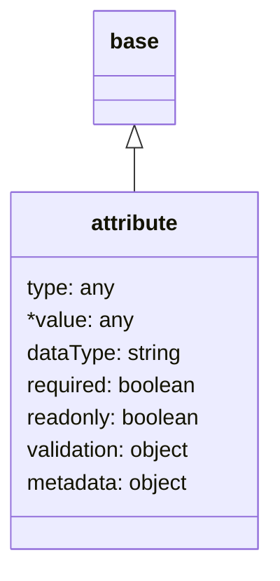

```mermaid
classDiagram
  class attribute {
    type: any
    *value: any
    dataType: string
    required: boolean
    readonly: boolean
    validation: object
    metadata: object
  }
  base <|-- attribute
```
