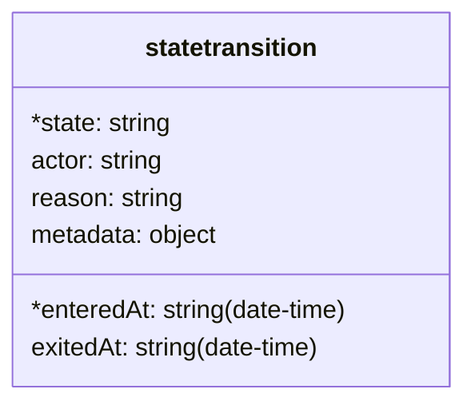

```mermaid
classDiagram
  class statetransition {
    *state: string
    *enteredAt: string (date-time)
    exitedAt: string (date-time)
    actor: string
    reason: string
    metadata: object
  }
```
