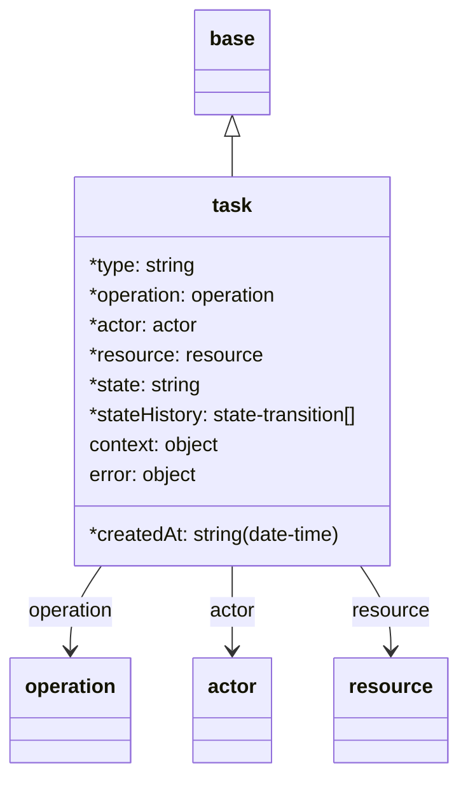

```mermaid
classDiagram
  class task {
    *type: string
    *operation: operation
    *actor: actor
    *resource: resource
    *state: string
    *createdAt: string (date-time)
    *stateHistory: state-transition[]
    context: object
    error: object
  }
  base <|-- task
  task --> operation : operation
  task --> actor : actor
  task --> resource : resource
```
