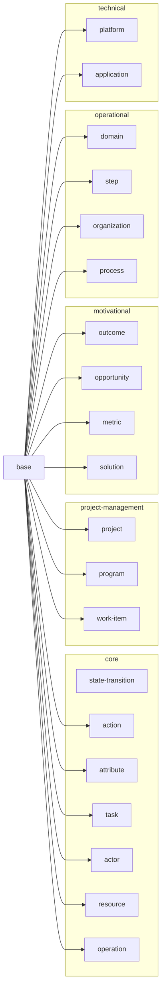

```mermaid
graph LR
  subgraph core["core"]
    statetransition["state-transition"]
    action["action"]
    attribute["attribute"]
    task["task"]
    actor["actor"]
    resource["resource"]
    operation["operation"]
  end
  subgraph projectmanagement["project-management"]
    project["project"]
    program["program"]
    workitem["work-item"]
  end
  subgraph motivational["motivational"]
    outcome["outcome"]
    opportunity["opportunity"]
    metric["metric"]
    solution["solution"]
  end
  subgraph operational["operational"]
    domain["domain"]
    step["step"]
    organization["organization"]
    process["process"]
  end
  subgraph technical["technical"]
    platform["platform"]
    application["application"]
  end
  base --> action
  base --> attribute
  base --> task
  base --> actor
  base --> resource
  base --> operation
  base --> project
  base --> program
  base --> workitem
  base --> outcome
  base --> opportunity
  base --> metric
  base --> solution
  base --> domain
  base --> step
  base --> organization
  base --> process
  base --> platform
  base --> application
```
