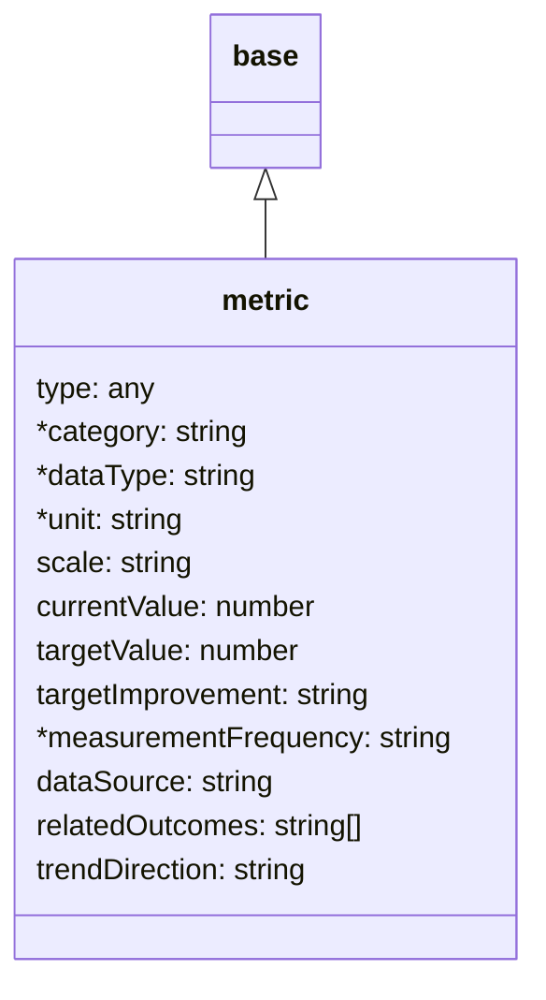

```mermaid
classDiagram
  class metric {
    type: any
    *category: string
    *dataType: string
    *unit: string
    scale: string
    currentValue: number
    targetValue: number
    targetImprovement: string
    *measurementFrequency: string
    dataSource: string
    relatedOutcomes: string[]
    trendDirection: string
  }
  base <|-- metric
```
