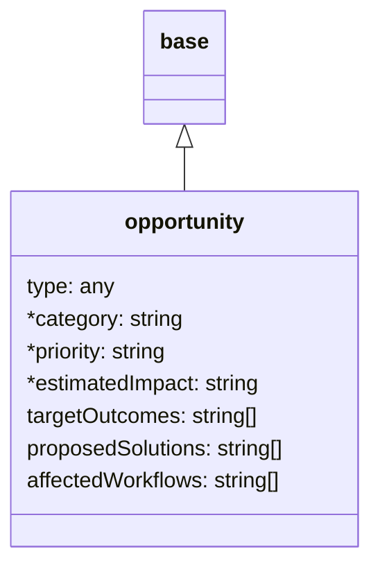

```mermaid
classDiagram
  class opportunity {
    type: any
    *category: string
    *priority: string
    *estimatedImpact: string
    targetOutcomes: string[]
    proposedSolutions: string[]
    affectedWorkflows: string[]
  }
  base <|-- opportunity
```
