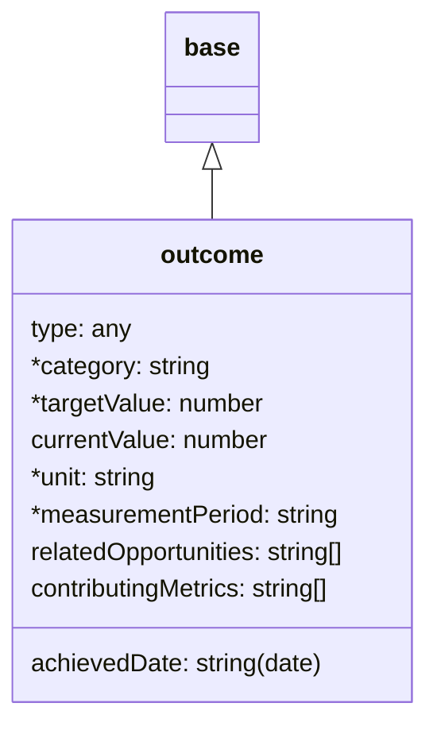

```mermaid
classDiagram
  class outcome {
    type: any
    *category: string
    *targetValue: number
    currentValue: number
    *unit: string
    *measurementPeriod: string
    achievedDate: string (date)
    relatedOpportunities: string[]
    contributingMetrics: string[]
  }
  base <|-- outcome
```
