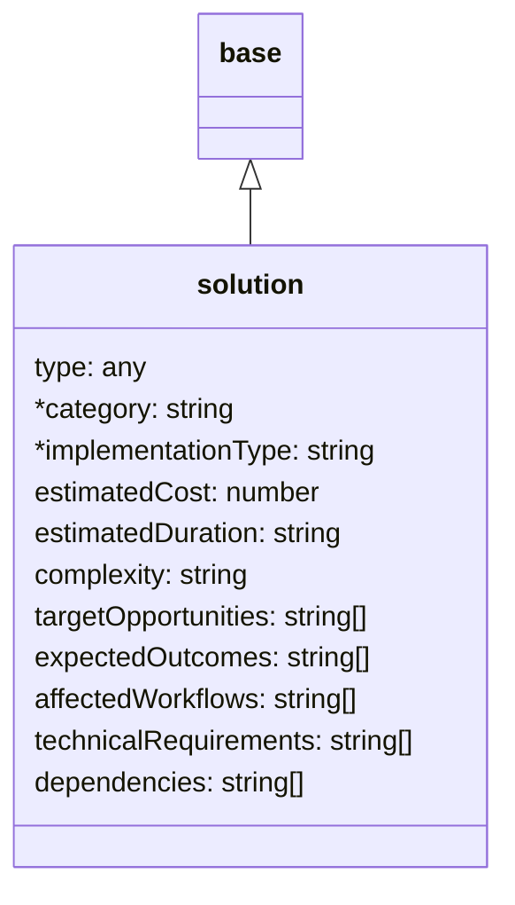

```mermaid
classDiagram
  class solution {
    type: any
    *category: string
    *implementationType: string
    estimatedCost: number
    estimatedDuration: string
    complexity: string
    targetOpportunities: string[]
    expectedOutcomes: string[]
    affectedWorkflows: string[]
    technicalRequirements: string[]
    dependencies: string[]
  }
  base <|-- solution
```
