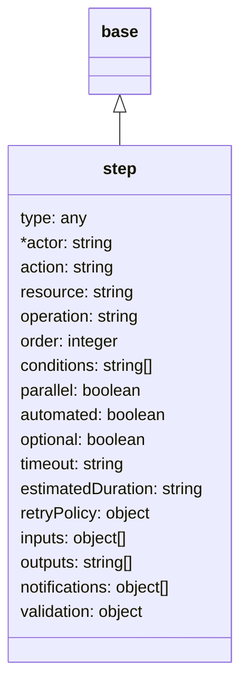

```mermaid
classDiagram
  class step {
    type: any
    *actor: string
    action: string
    resource: string
    operation: string
    order: integer
    conditions: string[]
    parallel: boolean
    automated: boolean
    optional: boolean
    timeout: string
    estimatedDuration: string
    retryPolicy: object
    inputs: object[]
    outputs: string[]
    notifications: object[]
    validation: object
  }
  base <|-- step
```
