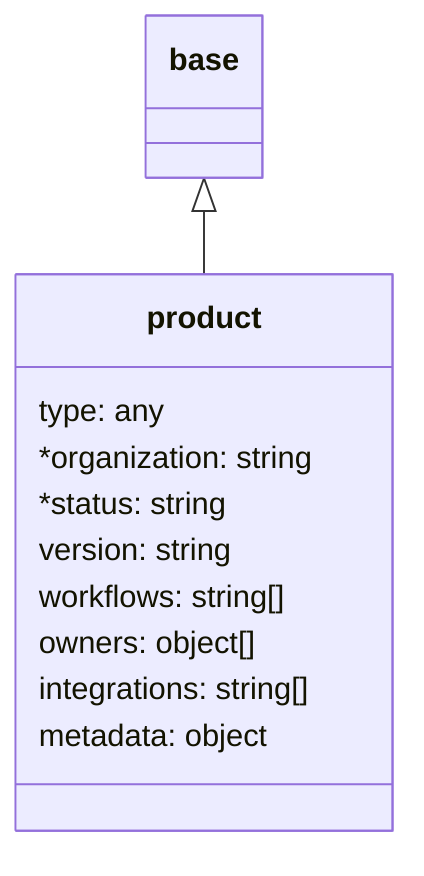

```mermaid
classDiagram
  class product {
    type: any
    *organization: string
    *status: string
    version: string
    workflows: string[]
    owners: object[]
    integrations: string[]
    metadata: object
  }
  base <|-- product
```
