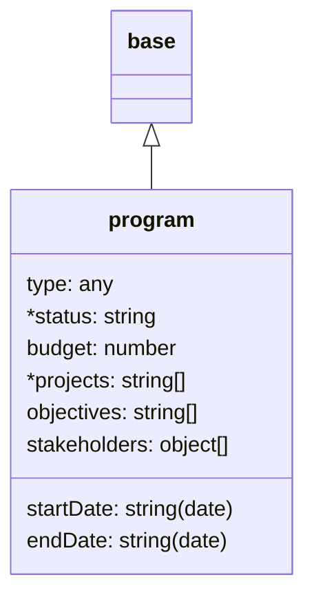

```mermaid
classDiagram
  class program {
    type: any
    startDate: string (date)
    endDate: string (date)
    *status: string
    budget: number
    *projects: string[]
    objectives: string[]
    stakeholders: object[]
  }
  base <|-- program
```
