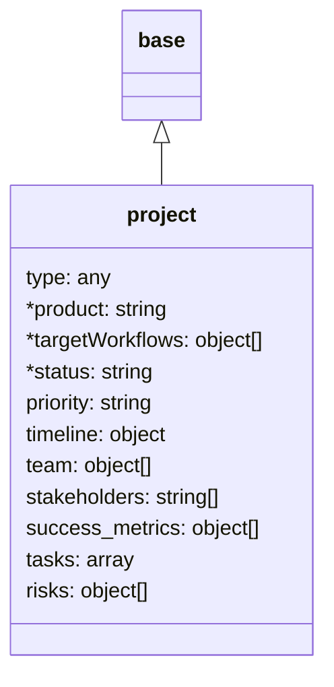

```mermaid
classDiagram
  class project {
    type: any
    *product: string
    *targetWorkflows: object[]
    *status: string
    priority: string
    timeline: object
    team: object[]
    stakeholders: string[]
    success_metrics: object[]
    tasks: array
    risks: object[]
  }
  base <|-- project
```
