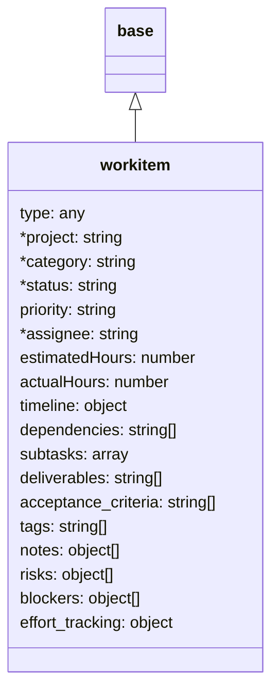

```mermaid
classDiagram
  class workitem {
    type: any
    *project: string
    *category: string
    *status: string
    priority: string
    *assignee: string
    estimatedHours: number
    actualHours: number
    timeline: object
    dependencies: string[]
    subtasks: array
    deliverables: string[]
    acceptance_criteria: string[]
    tags: string[]
    notes: object[]
    risks: object[]
    blockers: object[]
    effort_tracking: object
  }
  base <|-- workitem
```
